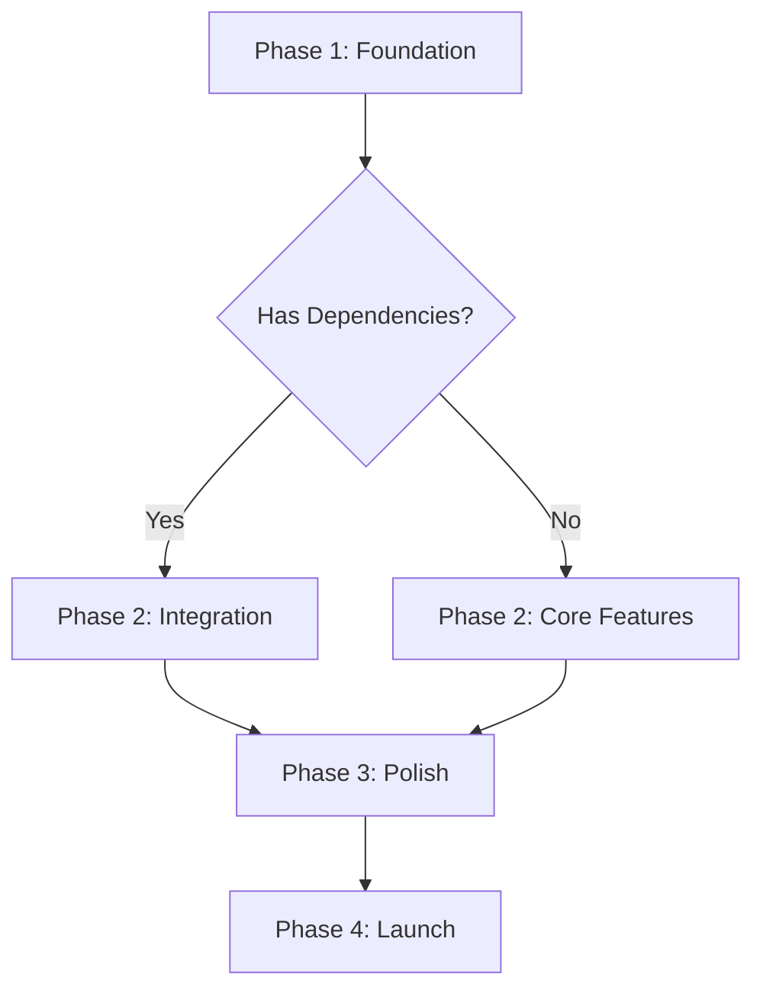

## User Input

```text
$ARGUMENTS
```

You **MUST** consider the user input before proceeding (if not empty).

## Outline

1. **Setup**: Run `{SCRIPT}` from repo root to create vibe plan file structure and get paths
2. **Understand Context**: Read `/memory/vibe-guidelines.md` and `/memory/vibe-context.md`
3. **Create Vibe Plan**: Generate plan.md with phases, unknowns, and success criteria
4. **Update Agent Context**: Run agent script to sync plan context with your AI assistant
5. **Report**: Show plan structure and next steps

## Vibe Plan Structure

Create `plan.md` with:

### 1. Vision & Scope
- **What we're building**: 1-2 sentence description
- **Why it matters**: User value, business reason
- **Success metric**: How do we know this worked?

### 2. Key Phases (3-5 max)
For each phase:
- **Name & description**: What's happening
- **Key work**: Main things to do
- **Assumptions**: What we're assuming to be true
- **Success signal**: How do we know this phase is done?
- **Confidence**: 1-10 on feasibility

### 3. Technical Context
- **Tech stack decisions**: What we're using and why
- **Dependencies**: External systems, APIs, data
- **Unknowns**: NEEDS CLARIFICATION items
- **Constraints**: Time, scope, performance, security

### 4. Execution Flow & Dependencies

#### Phase Sequencing Logic


#### Parallel Execution Rules
- **Parallel phases** have no shared dependencies or resources
- **Sequential phases** require output from previous phase
- **Integration checkpoints** defined at phase boundaries

#### Blocker Response Protocol
1. **Critical blockers** (< 2 hours): Stop all work, escalate immediately
2. **High blockers** (2-4 hours): Pause current phase, work on alternative
3. **Medium blockers** (4-8 hours): Document and continue with mitigation
4. **Low blockers** (> 8 hours): Queue for resolution, track impact

#### Pivot Triggers
- **Confidence drops below 5** in any phase
- **Major assumption invalidated** (proven wrong)
- **External dependency change** (API deprecated, tool unavailable)
- **Timeline compression** required (stakeholder request)

### 5. Confidence Assessment Framework

#### Confidence Scoring Methodology
Score based on **reproducibility** and **expertise level**:

- **10**: **Exact replication** - We've built this exact thing before, using same tech stack
- **9**: **Strong familiarity** - Same domain, similar patterns, documented approaches
- **8**: **Competent execution** - Similar patterns exist, minor adaptations needed
- **7**: **Sound approach** - Documented methodology exists, needs validation
- **6**: **Directionally correct** - We know the approach, uncertain on implementation details
- **5**: **Exploratory phase** - We have a working hypothesis, needs testing/research
- **4**: **Research required** - We understand goals, significant unknowns remain
- **3**: **Experimental approach** - High uncertainty, multiple viable paths exist
- **2**: **Speculative planning** - Goals are clear, path is highly uncertain  
- **1**: **Conceptual exploration** - Even the approach needs definition

#### Risk Assessment Matrix
For each phase, assess:

| Risk Type | Likelihood | Impact | Mitigation Strategy |
|------------|-------------|---------|-------------------|
| **Technical** | High/Med/Low | Critical/Med/High | [Specific action] |
| **Timeline** | High/Med/Low | Critical/Med/High | [Buffer/Alternative] |
| **Resource** | High/Med/Low | Critical/Med/High | [Cross-train/Outsource] |
| **Dependency** | High/Med/Low | Critical/Med/High | [Fallback/Parallel] |

#### Confidence Triggers
**Stop and clarify when confidence drops:**
- More than 3 points between initial score and current assessment
- Score below 5 for any phase
- Multiple assumptions marked as "NEEDS CLARIFICATION"

## Phase Template

```markdown
## Phase [#]: [Name]

### What
[What we're doing in 2-3 sentences]

### Why
[Why this phase matters]

### Work Items
- [Main work]
- [Main work]
- [Main work]

### Context Preservation System

#### Phase Transition Checklist
When moving between phases, ensure:
- [ ] **Previous phase validated**: All acceptance criteria met
- [ ] **Key decisions documented**: Rationale recorded for major choices
- [ ] **Assumptions updated**: Invalidated assumptions removed/updated
- [ ] **Context synced**: Agent tools updated with latest plan state

#### Confidence Tracking
Record confidence evolution for each phase:
```markdown
### Phase Confidence Timeline
| Phase | Initial | Mid-Phase | Final | Trend | Notes |
|-------|---------|----------|-------|-------|--------|
| [Phase] | [Score]/10 | [Score]/10 | [Score]/10 | [↑/↓/→] | [Key changes] |
```

#### Decision Audit Trail
Maintain record of:
- **Major choices** with alternatives considered
- **Assumption validations** with outcomes  
- **Pivot decisions** with reasons and impact assessment

#### Risk Register
| Risk | Likelihood | Impact | Mitigation | Status |
|------|-----------|---------|----------|------------|----------|
| [Risk] | [Low/Med/High] | [Low/Med/High] | [Strategy] | [Active/Mitigated] |

### Key Decisions
| Decision | Choice | Rationale | Risk Level |
|----------|--------|-----------|------------|
| [What] | [Decision] | [Why] | [Low/Med/High] |

### Assumption Validation
| Assumption | Validation Method | Risk if Wrong | Status |
|------------|-------------------|---------------|---------|
| [Assumption] | [How to test] | [Impact] | [Validated/Needs Test] |

### Critical Assumptions
| # | Assumption | Risk if Wrong | Validation Plan | Owner |
|---|------------|---------------|---------------|--------|
| 1 | [Specific assumption] | [Critical/High/Med/Low impact] | [How/when to validate] | [Who validates] |
| 2 | [Specific assumption] | [Critical/High/Med/Low impact] | [How/When to validate] | [Who validates] |

### Risk Mitigation Checklist
- [ ] **Technical risks documented and mitigation planned**
- [ ] **Timeline risks identified with buffer strategies** 
- [ ] **Resource risks assessed and backup plans ready**
- [ ] **External dependencies validated and fallbacks defined**

### Success Signal Framework
**Definition of "Done" for each phase**:
- **Functional complete**: All outlined work items delivered
- **Quality achieved**: Acceptance criteria met and validated
- **Dependencies resolved**: No blocking issues remaining
- **Confidence threshold**: Average confidence ≥ 7 across all tasks in phase

**Phase Completion Validation**:
1. **Functional review**: Test all deliverables against acceptance criteria
2. **Integration testing**: Verify components work together as specified
3. **Performance validation**: Confirm non-functional requirements met (speed, security, usability)
4. **Documentation**: Update decisions, assumptions, and lessons learned

**Confidence-based progression rules**:
- **8+ average confidence**: Proceed to next phase
- **5-7 average confidence**: Address issues before proceeding
- **<5 average confidence**: Replan phase or conduct additional research
- [What validation do we need?]

### Confidence: [X/10]
[Why this score]
```

## Agent-Specific Guidance & Smart Workflow Integration

### For Claude (Narrative Reasoning Agent)
**Strengths**: Complex problem analysis, stakeholder communication, comprehensive planning
**Best for**: Initial planning, risk assessment, stakeholder alignment
**Workflow optimization**:
- Take time to analyze thoroughly and consider multiple perspectives
- Document comprehensively with detailed rationale
- Use narrative reasoning to connect business goals with technical execution
- Flag subtle dependencies and stakeholder dynamics

### For Cursor (IDE Integration Agent)
**Strengths**: Fast iteration, code quality focus, immediate technical feedback
**Best for**: Technical validation, architecture decisions, implementation planning
**Workflow optimization**:
- Focus on executable details and code-level implications
- Validate technical assumptions with concrete examples
- Emphasize maintainability, testing, and code quality
- Provide immediate technical feedback on feasibility

### For Copilot (Code Generation Agent)
**Strengths**: Rapid prototyping, pattern recognition, boilerplate generation
**Best for**: Technical validation, generating examples, exploring alternatives
**Workflow optimization**:
- Generate concrete code examples to validate assumptions
- Test technical approaches quickly with working prototypes
- Provide multiple implementation options with pros/cons
- Focus on practical, implementable solutions

### For Gemini (Multi-modal Agent)
**Strengths**: Broad knowledge synthesis, creative problem solving, comprehensive analysis
**Best for**: Exploring edge cases, validating assumptions, synthesizing diverse perspectives
**Workflow optimization**:
- Consider multiple angles and challenge assumptions systematically
- Provide comprehensive analysis of alternatives
- Synthesize information from diverse sources
- Identify non-obvious risks and opportunities

### Smart Workflow Integration

#### Automated Triggers
- **Confidence monitoring**: Alert when confidence drops below 6/10
- **Risk escalation**: Notify team when critical risks are identified
- **Stakeholder alignment**: Flag when perspectives conflict
- **Progress tracking**: Update confidence trends with early warnings

#### Context Preservation
- **Phase transitions**: Automatically carry forward validated assumptions
- **Risk register**: Maintain ongoing risk assessment across phases
- **Confidence evolution**: Track how certainty changes over time
- **Decision audit trail**: Preserve rationale for major choices

#### Intelligent Recommendations
- **Next phase suggestions**: Based on current confidence and risk levels
- **Clarification triggers**: Automatic suggestions when uncertainty is high
- **Resource allocation**: Recommendations based on complexity analysis
- **Timeline adjustments**: Dynamic planning based on progress patterns

## Key Rules

- **Stay flexible** — Plans can and will change
- **Document assumptions** — Make unknowns visible
- **Be honest about confidence** — Don't fake certainty
- **Think in phases** — Not individual tasks yet
- **Focus on flow** — Will execution be smooth?
- **Agent-aware** — Optimize approach for your AI assistant's strengths
- **Risk-first** — Address high-impact uncertainties early
- **Stakeholder-focused** — Ensure all voices are heard and aligned
