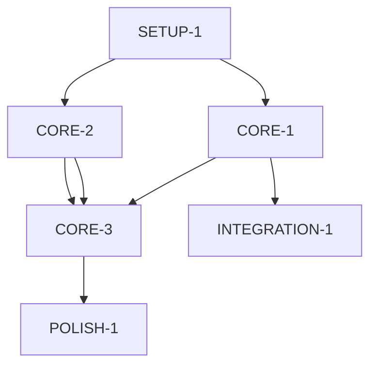
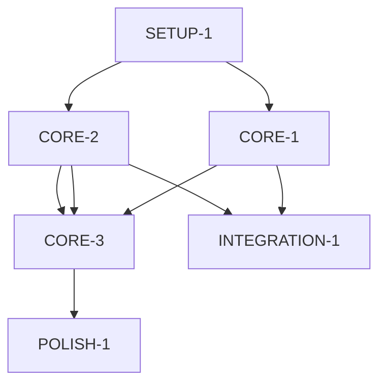

## User Input

```text
$ARGUMENTS
```

You **MUST** consider the user input before proceeding (if not empty).

## Outline

1. **Load context**: Read `plan.md` for phases, decisions, and dependencies
2. **Parse dependencies**: Identify task order, parallels, and blockers
3. **Generate tasks.md**: Create structured task breakdown with execution flow
4. **Validate**: Confirm tasks map to all plan items and dependencies are clear
5. **Report**: Show execution order and initial task queue

## Task Breakdown Structure

Create `tasks.md` with:

### 1. Execution Overview
- **Task count**: Total number of tasks
- **Critical path**: Which tasks form the longest dependency chain
- **Parallel opportunities**: Tasks that can run simultaneously
- **Estimated duration**: Rough timeline

### 2. Task List by Phase
For each plan phase, generate tasks:
- **Task ID**: [Phase]-[#] (e.g., SETUP-1, CORE-2)
- **Title**: Action verb + object ("Implement user auth", not "Work on auth")
- **Description**: What we're doing and why
- **Acceptance criteria**: How we know it's done
- **Depends on**: [TASK-ID] or "None"
- **Estimate**: XS (< 1 hour), S (1-2h), M (2-4h), L (4+ hours)
- **Priority**: High / Medium / Low

#### Task Complexity Factors
Add uncertainty multipliers based on:
- **Domain familiarity**: Done this before? (×0.5) vs new domain? (×2)
- **Technical uncertainty**: Known patterns? (×1) vs experimental? (×3)
- **Integration complexity**: Simple API? (×1) vs multiple systems? (×2)
- **Documentation quality**: Good examples exist? (×1) vs reverse engineering? (×2)

#### Enhanced Estimation Formula
**Base estimate** × **Complexity multiplier** = **Adjusted estimate**
- **XS**: 0.5-1h × complexity = actual
- **S**: 1-2h × complexity = actual  
- **M**: 2-4h × complexity = actual
- **L**: 4h+ × complexity = actual

#### Dependency Visualization


#### Parallel Execution Rules
- **[P] marker** = No shared dependencies with other P tasks
- **Resource conflicts** = Mark tasks that modify same files/database
- **Integration points** = Explicitly mark where parallel streams merge

### 3. Dependency Analysis
#### Critical Path Identification
- **Critical path** = Longest dependency chain
- **Parallel streams** = Independent task groups
- **Integration points** = Where parallel work merges

#### Risk Assessment for Each Task
| Task | Technical Risk | Timeline Risk | Resource Risk | Overall Risk | Mitigation |
|------|---------------|--------------|--------------|-------------|------------|
| [TASK] | [Low/Med/High] | [Low/Med/High] | [Low/Med/High] | [Score] | [Strategy] |

#### Dependency Graph Formats

**Text Format** (for quick reference):
```
SETUP-1 → CORE-1
CORE-1 → {CORE-2, INTEGRATION-1} [PARALLEL]
CORE-2 → CORE-3
{CORE-2, INTEGRATION-1} → POLISH-1
```

**Mermaid Format** (for visualization):


#### Bottleneck Identification
- **Single resource contention** = Multiple tasks need same person/tool
- **Sequential dependencies** = Tasks waiting on critical path
- **Unknown blockers** = Tasks with high uncertainty requiring research

### 4. Execution Strategy

#### Execution Queue & Tracking
```
1. SETUP-1 — Initialize project
2. [PARALLEL GROUP] 
   - CORE-1 [P] — Implement data model
   - CORE-2 [P] — Setup database
3. CORE-3 — API endpoints (depends on CORE-1, CORE-2)
4. POLISH-1 — Testing & validation
```

#### Real-time Status Tracking
For each task execution:
- **Start time**: When work begins
- **Confidence entry**: Initial assessment (1-10)
- **Progress updates**: Major milestones reached
- **Blocker log**: Issues encountered and resolution
- **End time**: When task completes
- **Final confidence**: Assessment of actual vs. estimated

#### Task Status Markers
- `[ ]` = Not started
- `[→]` = In progress (current task)
- `[✓]` = Done (current phase)
- `[⚠]` = Blocked with active issue
- `[🔄]` = Waiting for dependency/unblocked

### 5. Enhanced Task Template

```markdown
### [PHASE]-[#]: [Title]

**Description**: [2-3 sentences on what we're doing]

**Success Criteria** (measurable & unambiguous):
- [ ] **Functional**: [Specific outcome delivered]
- [ ] **Quality**: [Performance/standard met] 
- [ ] **Integration**: [Works with existing systems]

**Dependencies**: 
- **Blocks**: [TASK-ID] (must complete first)
- **Enables**: [TASK-ID] (prerequisites for others)

**Estimate**: [XS / S / M / L] 
- **Confidence**: [1-10] + [Rationale]

**Complexity Factors**:
- [ ] **Domain familiarity**: [Known/Partial/New]
- [ ] **Technical uncertainty**: [Low/Med/High]
- [ ] **Integration complexity**: [Simple/Moderate/Complex]

**Validation Method**:
- [ ] **How we verify**: [Test approach]
- [ ] **Rollback criteria**: [When to revert]

**Risk Assessment**:
- [ ] **Known risks**: [Potential issues]
- [ ] **Mitigation plan**: [How to address]
- [ ] **Confidence impact**: [How uncertainty affects timeline]

**Definition of Done**:
- [ ] **Functional complete**: [All requirements met]
- [ ] **Quality gates passed**: [Tests pass, performance ok]
- [ ] **Documentation updated**: [Changes recorded]
```

### 6. Context Preservation System

#### Task-to-Phase Mapping
Every task must map to a specific phase from `plan.md`:
```markdown
| Task | Target Phase | Completion Enables |
|-------|--------------|-------------------|
| [TASK] | [Phase name] | [Next phase trigger] |
```

#### Cross-Task Dependencies
Track how tasks affect each other:
- **Shared resources**: Tasks needing same person/tool
- **Data dependencies**: Tasks modifying same database/files
- **Sequential blockers**: Tasks that must complete before others start

#### Confidence Evolution Tracking
For each task completion:
```markdown
### Task Confidence Log
| Task | Initial | Final | Delta | Key Learnings |
|------|----------|--------|-------|--------------|--------------|
| [TASK] | [Score]/10 | [Score]/10 | [Change] | [What changed] |
```

#### Risk Monitoring
| Risk | Detected | Impact | Mitigation | Status |
|------|----------|---------|----------|------------|----------|
| [Risk] | [Yes/No] | [Low/Med/High] | [Strategy] | [Resolved/Ongoing] |

## Agent-Specific Guidance & Smart Workflow Integration

### For Claude (Narrative Reasoning Agent)
**Strengths**: Complex dependency analysis, stakeholder impact assessment, comprehensive planning
**Best for**: Task breakdown, dependency mapping, risk assessment
**Workflow optimization**:
- Analyze task interdependencies and stakeholder impacts
- Consider broader context and long-term implications
- Flag tasks that affect multiple stakeholders or systems
- Provide comprehensive rationale for task sequencing

### For Cursor (IDE Integration Agent)
**Strengths**: Code-level task estimation, technical dependency analysis, implementation validation
**Best for**: Technical task breakdown, code complexity assessment, implementation planning
**Workflow optimization**:
- Provide accurate time estimates based on code complexity
- Identify technical dependencies and integration points
- Validate tasks against existing codebase patterns
- Focus on maintainable, testable implementation approaches

### For Copilot (Code Generation Agent)
**Strengths**: Rapid task prototyping, pattern matching, boilerplate generation
**Best for**: Task validation, example generation, complexity assessment
**Workflow optimization**:
- Generate concrete examples for complex tasks
- Validate task feasibility with working prototypes
- Identify reusable patterns and boilerplate opportunities
- Provide multiple implementation approaches with trade-offs

### For Gemini (Multi-modal Agent)
**Strengths**: Broad task analysis, creative problem solving, comprehensive validation
**Best for**: Task validation, edge case identification, alternative approaches
**Workflow optimization**:
- Consider multiple implementation strategies
- Identify edge cases and error conditions
- Validate tasks against diverse scenarios
- Synthesize information from multiple technical domains

### Smart Workflow Integration

#### Automated Task Management
- **Dependency validation**: Check for circular dependencies and missing prerequisites
- **Complexity assessment**: Adjust estimates based on historical patterns
- **Parallel optimization**: Identify tasks that can safely run concurrently
- **Risk-based prioritization**: Flag high-risk tasks for early attention

#### Intelligent Task Suggestions
- **Pattern recognition**: Suggest similar tasks based on historical completion
- **Complexity warnings**: Alert when task complexity doesn't match estimates
- **Dependency optimization**: Recommend task reordering for better flow
- **Resource balancing**: Suggest task assignments based on team capacity

#### Progress Intelligence
- **Confidence trend analysis**: Track confidence evolution across task execution
- **Blocker pattern detection**: Identify recurring issues and systemic problems
- **Velocity optimization**: Learn from past performance to improve future estimates
- **Quality gate enforcement**: Ensure tasks meet acceptance criteria before completion

## Key Rules
- **Task = 1-4 hours of work max**
- **One responsibility per task**
- **Clear acceptance criteria**
- **Document all dependencies**
- **Identify research/spike tasks separately**
- **Mark parallel-ready tasks [P]**
- **Track confidence evolution** for pattern identification
- **Agent-optimized**: Leverage your AI assistant's specific strengths
- **Risk-aware**: Address high-complexity tasks early
- **Quality-focused**: Ensure tasks deliver measurable value
